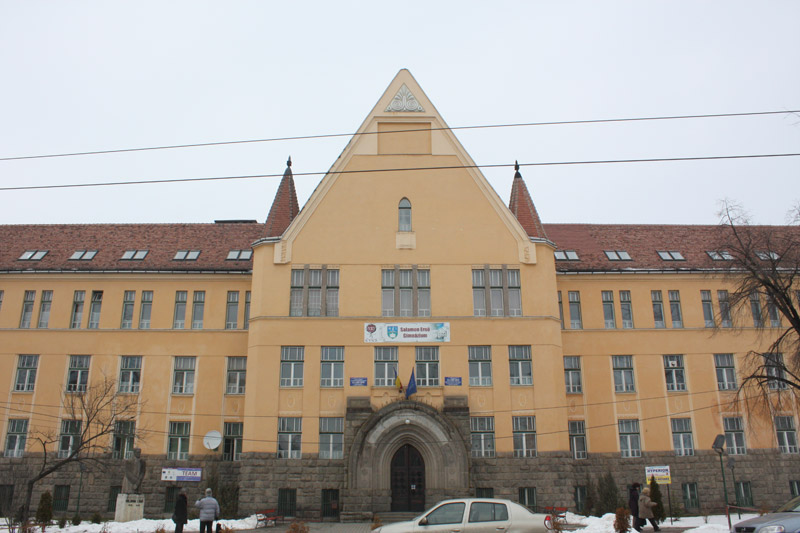
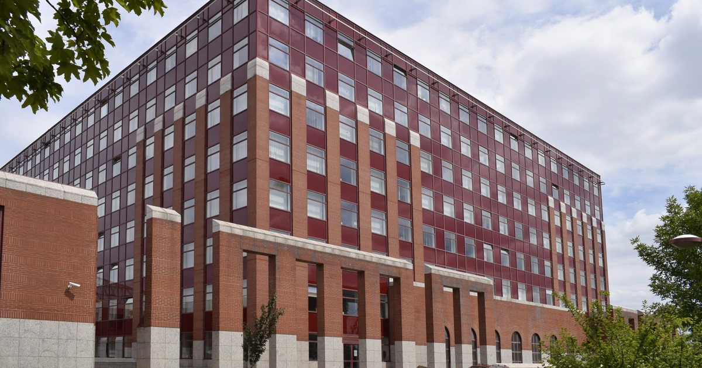
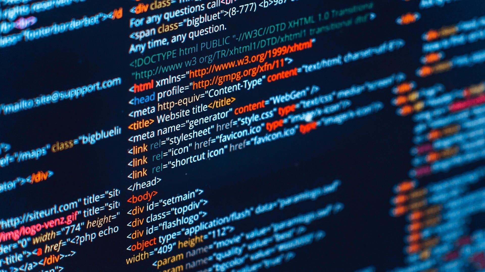

# Nav bar

---

## Icon


## Nav bar elements

    1. Home Page
    2. Learnings
    3. Specialities
    4. Schools
    5. Write

---

# 1. Home page

---

## Background image


## Heading 1

    PORTFOLIO

## Heading 2

    MY PROGRAMMING LIFE

---

# 2. Learnings

---

## Heading 1

    MY LEARNINGS

## Heading 2 (first)

    HIGH SCHOOL

### Text under heading 2 (first)

    I graduated in a school where my main subjects were mathematics and informatics. I learn basic programing languages such as c++, database (MYSQL) and web development and more.

## Heading 2 (second)

    UNIVERSITY

### Text under heading 2 (second)

    The chosen one is ELTE IK in Hungary, Budapest. There I dive into the deep, step up my career and I can see the path I want to be in.

### Button

#### Button: [See more](https://salamon.ro)

## Pictures


# Four cards

## Background


## Card 1

    Title: C++
    Text: I use this language to solve a lot of problems, mainly  mathematical questions.

## Card 2

    Title: MYSQL
    Text: I create databases with it. It helps to store informations like sales and suply refills. It has many other usage as well.

## Card 3

    Title: HTML
    Text: I learned the basics of HTML  and I like it because the code can be very semantic and see trough.

## Card 4

    Title: CSS/SCSS
    Text: The purpose of CSS/SCSS is to style HTML codes to create something beautiful for all users. I gained a lot of knowledge from it.

---

# 3. Specialities

---

# Heading 1

    WHAT I LIKE TO CODE

# <u>Card 1</u>

## _Front side_

    Title: HTML & CSS

### Background


### List

    - 5+ projects
    - 2 companies included
    - 3 years of experience
    - Still learning
    - Level: intermediate

## _Back side_

    Title: LEARN ABOUT

    Heading: HTML & CSS

#### Button: [See more](https://web.dev/learn/css/?gclid=CjwKCAiA8OmdBhAgEiwAShr40zOyjx_L9rcHqJCEQM2DxbXjzEzc0JUwxz62CK5MCdC1YHvpCdfkFxoC-bIQAvD_BwE)

# <u>Card 2</u>

## _Front side_

    Title: C++

### Background


### List

    - 100+ projects
    - Mathematical questions
    - 4 years of experience
    - Still learning
    - Level: intermediate

## _Back side_

    Title: LEARN ABOUT

    Heading: C++

#### Button: [See more](https://www.w3schools.com/cpp/)

# <u>Card 3</u>

## _Front side_

    Title: MYSQL

### Background


### List

    - 15+ projects
    - Database magamement
    - 1 years of experience
    - Still learning
    - Level: basic

## _Back side_

    Title: LEARN ABOUT

    Heading: MYSQL

#### Button: [See more](https://www.mysql.com)

# Button: [Discover main languages](list.html)

## List.html

## Card 1

| Card          | 1                  |
| ------------- | ------------------ |
| Title         | Text               |
| 1. JAVASCRIPT | - Web development  |
|               | - Game development |
|               | - Mobile apps      |

## Card 2

| Card      | 2                      |
| --------- | ---------------------- |
| Title     | Text                   |
| 2. PYTHON | - Back end development |
|           | - Data science         |
|           | - App development      |

## Card 3

| Card    | 3                     |
| ------- | --------------------- |
| Title   | Text                  |
| 3. HTML | - Web documents       |
|         | - Website development |
|         | - Website maintenance |

## Card 4

| Card    | 4                   |
| ------- | ------------------- |
| Title   | Text                |
| 4. RUST | - Operating systems |
|         | - VR                |
|         | - Web browsers      |

## Card 5

| Card   | 5                  |
| ------ | ------------------ |
| Title  | Text               |
| 5. CSS | - Web development  |
|        | - Game development |
|        | - Mobile apps      |

## Card 6

| Card   | 6                     |
| ------ | --------------------- |
| Title  | Text                  |
| 6. SQL | - Database management |
|        | - Sales reports       |
|        | - Business management |

## Card 7

| Card  | 7                         |
| ----- | ------------------------- |
| Title | Text                      |
| 7. C# | - Game development        |
|       | - Desktop/web/mobile apps |
|       | - VR                      |

## Card 8

| Card  | 8                            |
| ----- | ---------------------------- |
| Title | Text                         |
| 8. GO | - System/network programming |
|       | - Audio/video editing        |
|       | - Big Data                   |

## Button: [Home](index.html)

---

# 4. Schools

---

## Heading 1

    TEACHERS OF MINE

## Background-video

<video src="img/video.mp4" width="420" height="240" controls></video>

## Card 1

### Picture



### Heading 2

    Title: SALAMON ERNŐ GIMNÁZIUM
    Text: My school provided me to learn the basics of coding languages and it helped me to make a lot of progress in those. The continuity of learning got me in the position where I can solve almost any problems in some languages.

## Card 2

### Picture



### Heading 2

    Title: ELTE IK
    Text: ELTE IK's programming education: Strong theory, practical skills, research, industry ties, top-notch facilities, vibrant community. Prepares students for success in software engineering.

## Button: [Read about the University](https://www.inf.elte.hu)

---

# 5. Write

---

## Heading

    FEEL FREE TO ASK!

## Input text 1

    Full name

## Input text 2

    Email adress

## Input text 3

    Message

## Radio Button 1

    Personal

## Radio Button 2

    Work

## CheckBox

    I'm intrested in your business.

## Reset button

```HTML
<body id="body">
      <form class=main id="myForm">
      First name <input type="text" class="input-box" name="fname"><br><br>
      Last name <input type="text" class="input-box" name="lname"><br><br>
      <input type="button" class="button" onclick="myFunction()" value="Reset name">
      </form>
    </>
</body>

<script>
    function myFunction() {
        document.getElementById("myForm").reset();
    }
</script>
```

## Button: [Submit]()

## Background picture



---

# Footer on every page bottom

---

## Icon


## Links

- [FACEBOOK](https://www.facebook.com/tamas.ferencz.7399)
- [INSTAGRAM](https://www.instagram.com/ferencztamas_/)
- [EMAIL](mailto:tamasferencz25@gmailcom)
- [GITHUB](https://github.com/tamasferencz12)
- [CODEPEN](https://codepen.io/tamasferencz12?__cf_chl_captcha_tk__=4cef880d9bb8c9fdc7fe5899f0fd7c9ce9b06c5d-1626381495-0-AW3whcleY7ykyhY_y3EHVsOeawbybJqkMaU_WYz2LR7CYS8ZyyW7cfM4Fxw0n7PnfEmJDuZtNKRC62XX4tuCtg7LE6Y__8SeZ1moTGJZdncpmTVNyj1xRxZ7cmhFntY5FIoZoiqjqCtpJTkouhQj-kUpwC6EYSDNXUWHhvKdtIcCNlMtI8Tp6_aYrMn_3_VVH6rpXlEivEYb8O3cMua4GwzSZ2UaBjRAylbnHuMFIpRd6YZ8rtEIOekBSv2dREOqXQQQ7qEbtPaNWXCQ1PGfgK8IEnUy8klxl1nK4JcpzPa3kOoxbj3g4Uyp89EYmLcWL7oDxyEPIxSO5xNi3Bq99vFmnkS1D52oG4DoKo9ByrwYTrJ_hzOuMAgOWiGA1l5QOvpBrUOVDj4hf45rmIVJkxCG955OiBLzYQ5Y74aT1-0_TM2TtkxlroPBWRY1OOl4PrpddcwhfI8gf1SfrG71XzRZgyLs3JXp28zdDj75dw5KaRLBBjL81absJ4So6gWtmzDv47jUscCFqbW5xPzBdvnhoM9Qqb3zgr32xdNDprCrFkxZzZrLNFvq2YaLuMBs_irzgZm3CqGY_-BJngED_aiUOUTNhvoAWLTfD_ejsPN3yQ6vMZt9CgTsCBN-1Kn4b6lwmxIDDkA4SmD1ewh5eOhDtzucGMd35xUz461n7bhvW2yTwQA26RXc9LaXWhkzlQ)

## Copyright

    Built by TAMAS FERENCZ Copyright © by Tamas Ferencz.

---

# Javascript on every page (bottom right)

---

## Heading

    Mode

## Icon for dark mode


## Icon for light mode


```

```

